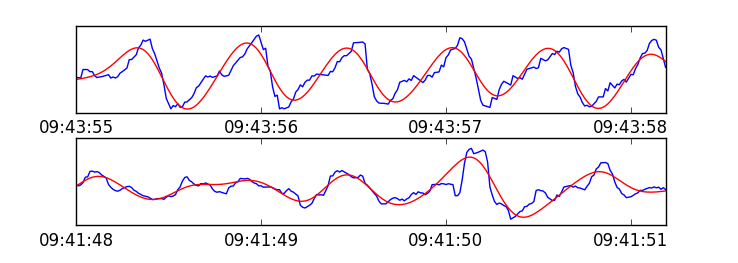

# Semi-supervised pattern recognition in PPG signals
**Please refer to the blog post for more information on this project if you are new.**
The purpose of this tutorial is to present self-training as a viable semi-supervised approach for regular pattern recognition in physiological signals, specifically using PPG or pulse oximetry, with only a few pre-labeled examples. The trained model can be applied during the signal pre-processing stage to distinguish relatively clean segments from ones affected by substantial noise and/or motion artifacts. It can achieve an observed accuracy as high as 94.7% using a limited initial training subset of 500 labels, and shows a performance increase compared to a 91% accuracy with a fully supervised model trained against the entire available labeled subset.

## Code and usage
Main dependencies: Tensorflow/Theano, Keras, scikit-learn.

Clone the repo and call main.py with no arguments to train the model and visualize plots of the confusion matrix, loss over epochs, and a few example segments demonstrating the classifier results, as shown below. Note: the code was written and tested in Python 3.

*Comparison of two types of labeled signals from the dataset, showing the original signal in blue, and a bandpass filtered version in red. Above: segment with high quality signal content, labeled positive. Below: segment content is random and should be rejected, labeled negative.*
